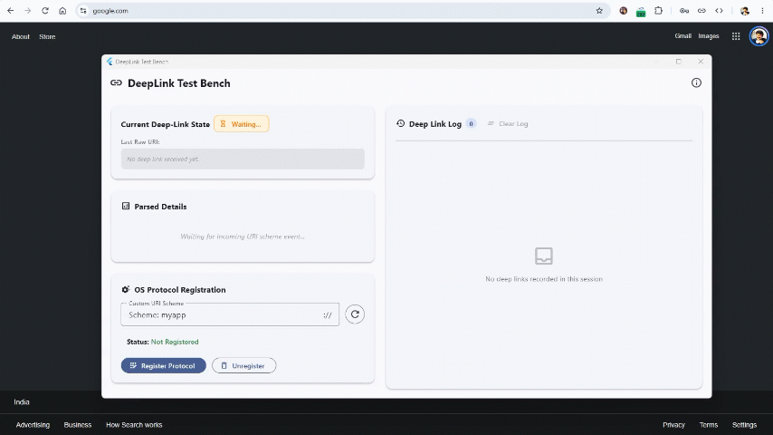

# DeepLink - Custom URI Scheme Handling for Flutter Desktop

[](https://flutter.dev) [](https://flutter.dev/desktop) [](https://riverpod.dev) [](https://www.ruturajpatki.com)

A minimal, production-grade Flutter Desktop Proof of Concept (POC) validating custom OS protocol / URI scheme handling (`myapp://`) across **Windows**, **macOS**, and **Linux** using [`app_links`](https://pub.dev/packages/app_links) and [`flutter_riverpod`](https://pub.dev/packages/flutter_riverpod).

**See it in action:**



---

## 🌟 Key Features

- 🔗 **Custom Protocol Registration**: Dynamically register and unregister custom protocol schemes (`myapp://` or user-specified custom schemes) directly with the OS without elevated administrator privileges on Windows (`HKCU\Software\Classes`), bundle configuration on macOS (`Info.plist`), and `.desktop` mime handlers on Linux.
- 🚀 **Cold-Start Launch Handling**: OS launches the application when a link is clicked and seamlessly delivers the URI payload on startup (marked as `INITIAL (COLD)`).
- ⚡ **Warm-Start / Single-Instance Forwarding**: When a deep link is clicked while the application is already running, the second process pipes the URI payload to the active window via native IPC (`SendAppLinkToInstance`) without creating duplicate app instances (marked as `RECEIVED (WARM)`).
- 📊 **Real-Time Parsing & Diagnostics**: Parses scheme, host, path, and all key-value query parameters dynamically into an intuitive desktop Material Design 3 interface.
- 📜 **Reverse-Chronological History Log**: Tracks all received deep link events with timestamp precision, event type tagging, duplicate-replay filtering, and a one-click log clearing utility.
- ℹ️ **Custom About Dialog & RC Metadata**: Full project credit specification including author details, clickable email/web/git links, and Windows `Runner.rc` metadata integration.

---

## 🎯 Example Deep Link URI

```text
myapp://project.task?pid=7654357788&intent=share
```

- **Scheme**: `myapp`
- **Host**: `project.task`
- **Query Parameters**:
  - `pid` = `7654357788`
  - `intent` = `share`

---

## 🏗️ Architecture & Project Structure

The project is located in `app/` and structured as follows:

```text
app/
├── lib/
│   ├── main.dart                          # App entry point & ProviderScope setup
│   ├── models/
│   │   └── deep_link_event.dart           # Immutable event model & URI parameter parser
│   ├── providers/
│   │   └── deep_link_provider.dart        # Riverpod 3 Notifier state management & deduplication
│   ├── services/
│   │   ├── deep_link_service.dart         # Wrapper for app_links URI stream
│   │   └── protocol_registration_service.dart # Platform-native OS protocol registration
│   ├── screens/
│   │   └── home_screen.dart               # Responsive Material 3 desktop layout
│   └── widgets/
│       └── about_dialog_widget.dart       # Custom About dialog with clickable links
├── windows/runner/
│   ├── main.cpp                           # Single-instance check (SendAppLinkToInstance)
│   └── Runner.rc                          # App resource strings (Author, Copyright, Product Name)
├── macos/Runner/
│   └── Info.plist                         # CFBundleURLTypes registration for myapp scheme
├── docs/
│   └── ARCHITECTURE.md                    # Detailed architecture & sequence control flows
└── test/
    ├── deep_link_test.dart                # Unit tests for Uri parsing & Riverpod providers
    └── widget_test.dart                   # Desktop UI widget tests
```

For complete sequence diagrams and component details, read [`docs/ARCHITECTURE.md`](docs/ARCHITECTURE.md).

---

## 🛠️ Technology Stack & Dependencies

- **Framework**: [Flutter 3.47.2](https://flutter.dev) (Dart 3.13)
- **State Management**: `flutter_riverpod: ^3.4.3`
- **Deep Link Engine**: `app_links: ^7.2.1`
- **Windows Registry API**: `win32_registry: ^3.0.3`
- **URL Launcher**: `url_launcher: ^6.3.2`

---

## 🚀 Getting Started

### Prerequisites

- Flutter SDK (>= 3.24.0) with Desktop support enabled (`flutter config --enable-windows-desktop --enable-macos-desktop --enable-linux-desktop`).
- C++ Build Tools for Windows (Visual Studio 2022 / Build Tools), Xcode (macOS), or `clang` / `cmake` / `ninja-build` / `pkg-config` / `libgtk-3-dev` (Linux).

### Installation & Run

1. Clone or navigate to the repository directory:
   
   ```bash
   cd app
   ```

2. Fetch dependencies:
   
   ```bash
   flutter pub get
   ```

3. Run in debug mode on your platform:
   
   ```bash
   # Windows
   flutter run -d windows
   
   # macOS
   flutter run -d macos
   
   # Linux
   flutter run -d linux
   ```

---

## 🧪 Testing Deep Links

### 1. Register the Protocol

Launch the application and click **Register Protocol** under **OS Protocol Registration** (or input a custom scheme e.g. `myapp`).

### 2. Test Warm-Start (App Already Running)

While the application is open, run in Command Prompt or PowerShell:

```powershell
start myapp://project.task?pid=7654357788&intent=share
```

The running window will immediately update its status card and record an event tagged as `RECEIVED (WARM)` in the history log.

### 3. Test Cold-Start (App Closed)

Close the application window completely, then execute:

```powershell
start myapp://project.task?pid=7654357788&intent=share
```

The OS will launch `deeplink_testbench.exe`, initialize the window, and log an event tagged as `INITIAL (COLD)`.

---

## 🧪 Quality Gates & Verification

Run static code analysis and tests inside `app/`:

```bash
# Static analysis
flutter analyze

# Unit & Widget tests
flutter test

# Build Release Binary (Windows)
flutter build windows
```

Executable output: `app/build/windows/x64/runner/Release/deeplink_testbench.exe`

---

## 👨‍💻 Author

**Developed by**: Ruturaj V Patki  
**Email**: assistance@ruturajpatki.com  
**Website**: [https://www.ruturajpatki.com](https://www.ruturajpatki.com)  
**GitHub**: [https://github.com/ruturajpatki](https://github.com/ruturajpatki)  
