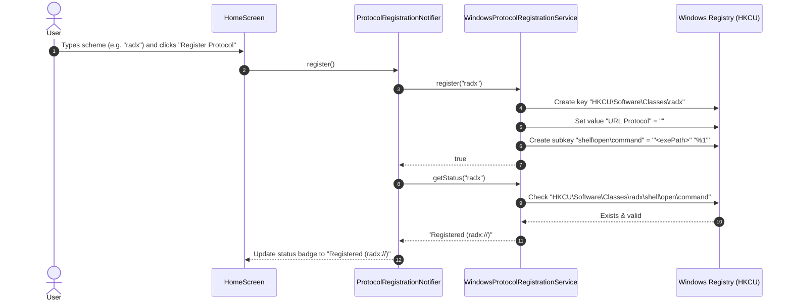
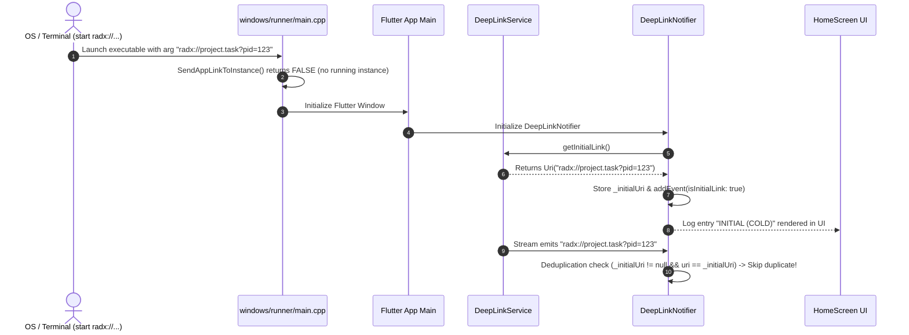
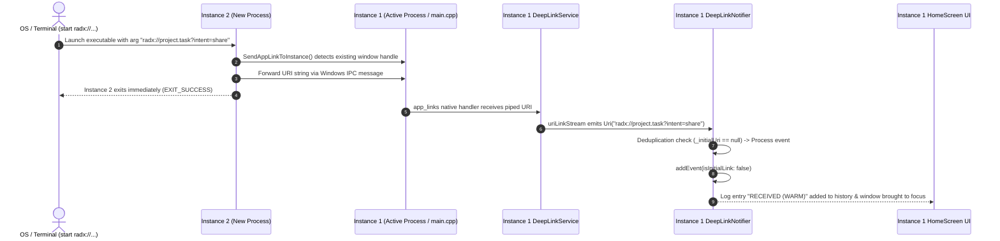

# RadX DeepLink POC - Architecture Documentation

This document describes the software architecture, file structure, component responsibilities, and runtime control flows for the RadX DeepLink Proof of Concept (`radx://`).

---

## 1. High-Level Architecture Overview

The application follows a clean, layered architecture leveraging **Flutter Material Design 3**, **Riverpod 3** for state management, **`app_links`** for OS URI listening, and **platform-native integrations** (Windows Registry via `win32_registry`, macOS `Info.plist`, Linux `.desktop` entries).

```mermaid
graph TD
    subgraph OS Platform Layer
        WIN[Windows OS / Registry]
        MAC[macOS Bundle / Info.plist]
        LNX[Linux Desktop / xdg-mime]
    end

    subgraph Native Runner Layer
        MAIN_CPP["windows/runner/main.cpp (SendAppLinkToInstance)"]
    end

    subgraph Service Layer
        DL_SVC[DeepLinkService - app_links]
        REG_SVC[ProtocolRegistrationService]
    end

    subgraph State Management Layer (Riverpod 3)
        DL_NOTIFIER[DeepLinkNotifier]
        REG_NOTIFIER[ProtocolRegistrationNotifier]
    end

    subgraph Presentation Layer (UI)
        HOME[HomeScreen]
        ABOUT[CustomAboutDialog]
    end

    WIN -->|Command Line / Registry| MAIN_CPP
    MAIN_CPP -->|Pipe URI| DL_SVC
    MAC -->|Apple Events| DL_SVC
    LNX -->|x-scheme-handler| DL_SVC

    DL_SVC -->|Cold & Warm Streams| DL_NOTIFIER
    REG_SVC <-->|Read/Write Scheme Registration| REG_NOTIFIER

    DL_NOTIFIER -->|DeepLinkState| HOME
    REG_NOTIFIER -->|ProtocolRegistrationState| HOME
    HOME --> ABOUT
```

---

## 2. Directory Structure & File Responsibilities

```text
app/
├── lib/
│   ├── main.dart                          # Application entry point & ProviderScope initialization
│   ├── models/
│   │   └── deep_link_event.dart           # Immutable model for deep link events & parameter parsing
│   ├── providers/
│   │   └── deep_link_provider.dart        # Riverpod 3 Notifier state management & startup deduplication
│   ├── services/
│   │   ├── deep_link_service.dart         # Service wrapper around app_links API
│   │   └── protocol_registration_service.dart # OS protocol registration for Windows, macOS, Linux
│   ├── screens/
│   │   └── home_screen.dart               # Responsive Material 3 desktop UI layout
│   └── widgets/
│       └── about_dialog_widget.dart       # Custom About Dialog with author credits & external links
├── windows/runner/
│   ├── main.cpp                           # Single-instance check (SendAppLinkToInstance)
│   └── Runner.rc                          # Application metadata and copyright resource strings
├── macos/Runner/
│   └── Info.plist                         # CFBundleURLTypes registration for radx scheme
└── test/
    ├── deep_link_test.dart                # Unit tests for URI parsing, event immutability & Riverpod state
    └── widget_test.dart                   # Desktop UI widget test suite
```

### Component Details

| File | Responsibilities |
| :--- | :--- |
| **`main.dart`** | Configures `ProviderScope` and material theme (system dark/light mode, custom primary color seed). |
| **`models/deep_link_event.dart`** | Represents an immutable deep link event. Dynamically extracts `scheme`, `host`, `path`, and `queryParameters` from `Uri`. Formats timestamps for display. |
| **`services/deep_link_service.dart`** | Abstraction over `app_links`. Exposes `getInitialLink()` for cold-start and `uriLinkStream` for warm-start. |
| **`services/protocol_registration_service.dart`** | Handles OS protocol registration: <br>• **Windows**: Reads/writes `HKCU\Software\Classes\<scheme>` via `win32_registry`.<br>• **macOS**: Bundle-configured via `Info.plist`.<br>• **Linux**: Manages `~/.local/share/applications/<scheme>-handler.desktop` and executes `xdg-mime`. |
| **`providers/deep_link_provider.dart`** | Contains `DeepLinkNotifier` and `ProtocolRegistrationNotifier`. Implements startup deduplication so cold-boot links are not re-logged by the initial stream replay. |
| **`screens/home_screen.dart`** | Renders responsive desktop interface: State Status Card, Dynamic Parsed Key-Value Table, Scheme Registration Text Input & Action Controls, and Reverse-Chronological Log. |
| **`widgets/about_dialog_widget.dart`** | Implements custom modal dialog displaying app info, author details (`Ruturaj V Patki`), and launchable URL links (`url_launcher`). |

---

## 3. Control Flows

### A. Protocol Registration Flow (Windows)



---

### B. Cold-Start Control Flow



---

### C. Warm-Start / Single-Instance Control Flow



---

## 4. Quality Gates & Testing Architecture

The codebase enforces strict quality controls:
- **Lint & Static Analysis**: Zero warnings under `flutter analyze`.
- **Unit Tests (`test/deep_link_test.dart`)**:
  - `Uri` parameter parsing and key-value mapping.
  - Immutability and equality contracts of `DeepLinkEvent`.
  - `DeepLinkNotifier` state updates, event ordering, and `clearLog()` capability.
- **Widget Tests (`test/widget_test.dart`)**:
  - Rendering of desktop Material 3 cards, app bar, status badges, and registration controls.
